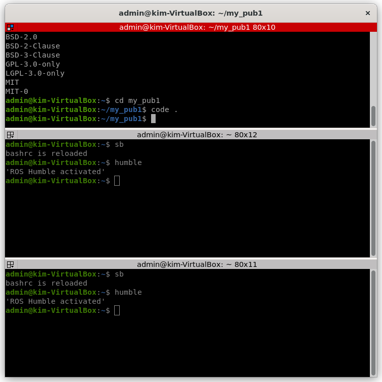
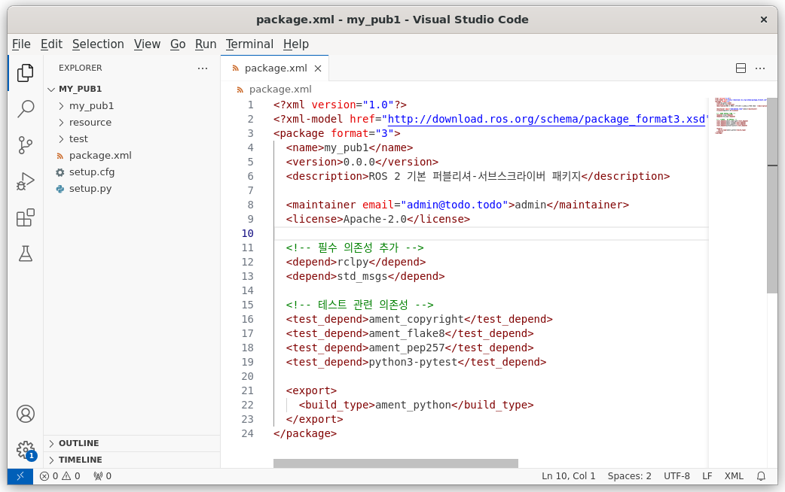
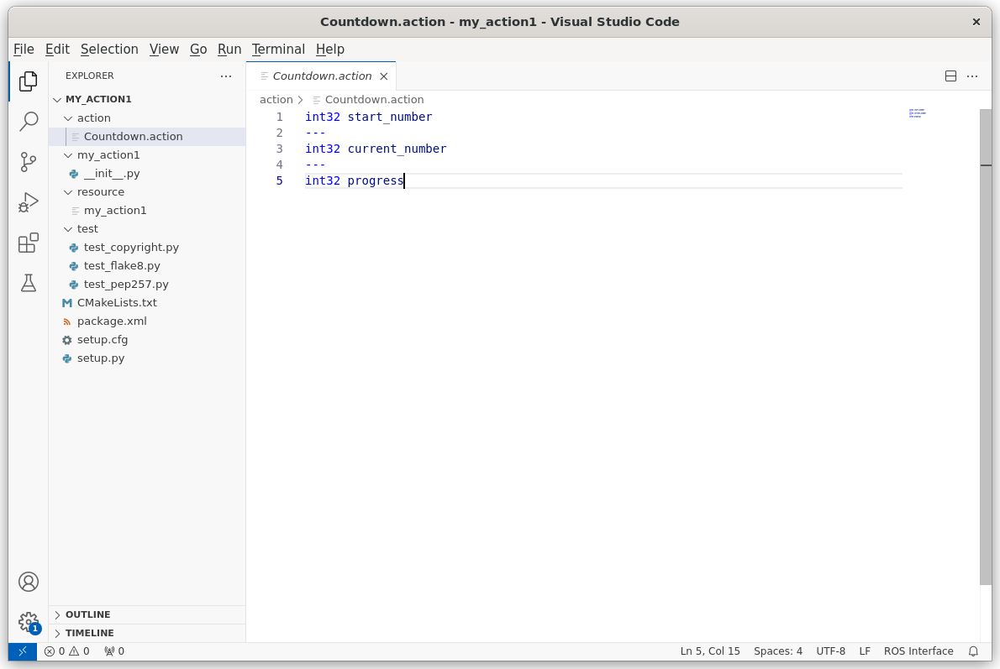
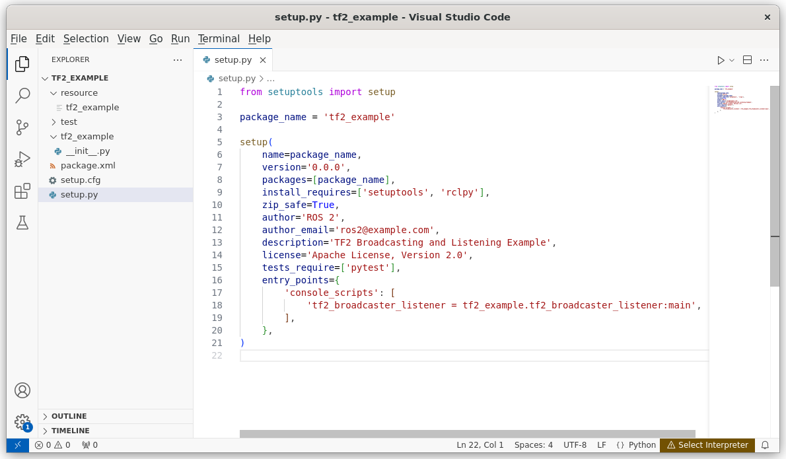
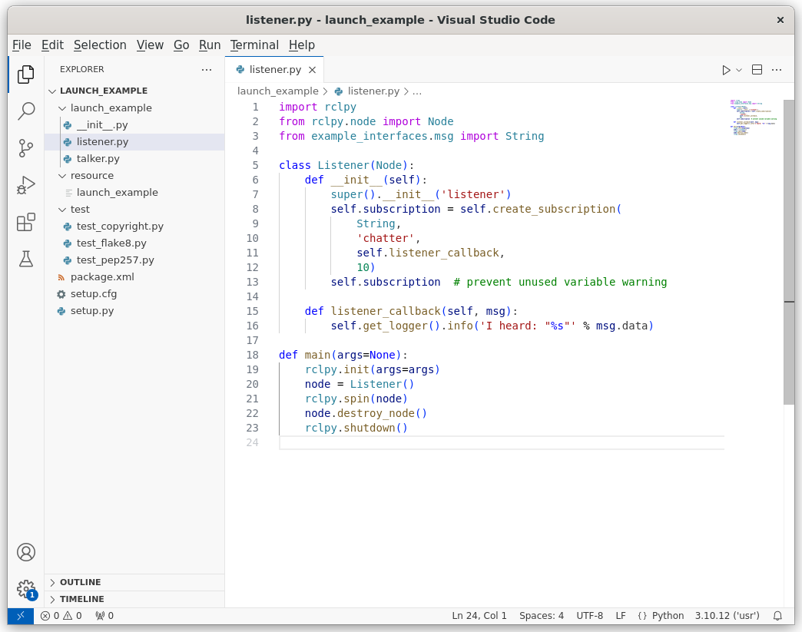

# ROS2 패키지 예제

# 1. **기본 퍼블리셔-서브스크라이버 패키지 제작**

- **`rclpy`를 이용한 기본적인 퍼블리셔(`publisher`)와 서브스크라이버(`subscriber`) 실습**

**ROS 2에서 `rclpy`를 이용하여 퍼블리셔(Publisher)와 서브스크라이버(Subscriber)를 구현하는 기본적인 패키지 실습을 진행하겠습니다.**

## **1-1. 패키지 생성**

우선, 새로운 ROS 2 패키지를 생성합니다.

```bash
ros2 pkg create --build-type ament_python my_pub1
```

위 명령을 실행하면 `my_pub1`이라는 패키지가 생성됩니다.


---




## **1-2. 의존성 추가**

`package.xml` 파일을 열어서 아래와 같이 `rclpy`와 `std_msgs`를 추가합니다.

```xml
...
<depend>rclpy</depend>
<depend>std_msgs</depend>
.....

```

그리고 `setup.py`의 `install_requires`에도 `rclpy`를 추가합니다.

```python
.......
install_requires=['setuptools', 'rclpy', 'std_msgs'],
......
```

---




## **1-3. 퍼블리셔 코드 작성 (`publisher.py`)**

이제 `my_pub1/my_pub1` 폴더 안에 `publisher.py` 파일을 생성하고, 아래의 코드를 작성합니다.

```python
import rclpy
from rclpy.node import Node
from std_msgs.msg import String

class SimplePublisher(Node):
    def __init__(self):
        super().__init__('simple_publisher')
        self.publisher_ = self.create_publisher(String, 'chatter', 10)
        self.timer = self.create_timer(1.0, self.timer_callback)

    def timer_callback(self):
        msg = String()
        msg.data = 'Hello, ROS 2!'
        self.publisher_.publish(msg)
        self.get_logger().info(f'Publishing: {msg.data}')

def main(args=None):
    rclpy.init(args=args)
    node = SimplePublisher()
    rclpy.spin(node)
    node.destroy_node()
    rclpy.shutdown()

if __name__ == '__main__':
    main()
```

---


## **1-4. 서브스크라이버 코드 작성 (`subscriber.py`)**

다음으로 `my_pub1/my_pub1` 폴더 안에 `subscriber.py` 파일을 생성하고, 아래의 코드를 작성합니다.

```python
import rclpy
from rclpy.node import Node
from std_msgs.msg import String

class SimpleSubscriber(Node):
    def __init__(self):
        super().__init__('simple_subscriber')
        self.subscription = self.create_subscription(
            String,
            'chatter',
            self.listener_callback,
            10)
        self.subscription  # prevent unused variable warning

    def listener_callback(self, msg):
        self.get_logger().info(f'Received: {msg.data}')

def main(args=None):
    rclpy.init(args=args)
    node = SimpleSubscriber()
    rclpy.spin(node)
    node.destroy_node()
    rclpy.shutdown()

if __name__ == '__main__':
    main()
```

---


## **1-5. 실행 파일 등록**

`setup.py`에서 실행 파일을 등록해야 합니다. `entry_points` 부분을 아래와 같이 수정합니다.

```python
......
entry_points={
    'console_scripts': [
        'publisher = my_pub1.publisher:main',
        'subscriber = my_pub1.subscriber:main',
    ],
},
........
```

---


## **1-6. 패키지 빌드**

패키지를 빌드합니다.

```bash
colcon build --packages-select my_pubsub
```

빌드가 완료되면 아래 명령어로 환경을 설정합니다.

```bash
source install/setup.bash
```

---


## **1-7. 노드 실행**

1. 퍼블리셔 실행:

```bash
ros2 run my_pubsub publisher
```

1. 서브스크라이버 실행 (새로운 터미널에서):

```bash
ros2 run my_pubsub subscriber
```


퍼블리셔에서 메시지를 전송하면, 서브스크라이버에서 해당 메시지를 받을 것입니다.


<br><br>

# 2. **서비스-클라이언트 패키지 제작**

- 서비스 서버(`Service Server`)와 클라이언트(`Client`)를 구현하는 패키지
- `example_interfaces.srv.AddTwoInts`를 사용하여 두 숫자를 더하는 기능

**ROS 2에서 서비스 서버(Service Server)와 클라이언트(Client)를 구현하는 패키지 실습을 진행하겠습니다.**

**이 실습에서는 example_interfaces.srv.AddTwoInts 를 사용하여 두 숫자를 더하는 기능을 구현합니다.**

## **2-1. 패키지 생성**

먼저, 새 ROS 2 패키지를 생성합니다.

```bash
ros2 pkg create --build-type ament_python my_service
```

위 명령을 실행하면 `my_service` 패키지가 생성됩니다.

---


# **2-2. 의존성 추가**

`package.xml` 파일을 열고, 아래 의존성을 추가합니다.

```xml
....
<depend>rclpy</depend>
<depend>example_interfaces</depend>
....
```


그리고 `setup.py` 파일에서 `install_requires` 부분을 수정합니다.

```python
.....
install_requires=['setuptools', 'rclpy', 'example_interfaces'],
.....
```


---

## **2-3. 서비스 서버 코드 작성 (`service_server.py`)**

이제 `my_service/my_service` 폴더 안에 `service_server.py` 파일을 생성하고, 아래의 코드를 작성합니다.

```python
import rclpy
from rclpy.node import Node
from example_interfaces.srv import AddTwoInts

class AddTwoIntsServer(Node):
    def __init__(self):
        super().__init__('add_two_ints_server')
        self.srv = self.create_service(AddTwoInts, 'add_two_ints', self.add_two_ints_callback)
        self.get_logger().info('Service Server is Ready.')

    def add_two_ints_callback(self, request, response):
        response.sum = request.a + request.b
        self.get_logger().info(f'Received: {request.a} + {request.b} = {response.sum}')
        return response

def main():
    rclpy.init()
    node = AddTwoIntsServer()
    rclpy.spin(node)
    node.destroy_node()
    rclpy.shutdown()

if __name__ == '__main__':
    main()
```


---

## **2-4. 서비스 클라이언트 코드 작성 (`service_client.py`)**

다음으로 `my_service/my_service` 폴더 안에 `service_client.py` 파일을 생성하고, 아래의 코드를 작성합니다.

```python
import rclpy
from rclpy.node import Node
from example_interfaces.srv import AddTwoInts

class AddTwoIntsClient(Node):
    def __init__(self):
        super().__init__('add_two_ints_client')
        self.cli = self.create_client(AddTwoInts, 'add_two_ints')

        while not self.cli.wait_for_service(timeout_sec=1.0):
            self.get_logger().info('Service not available, waiting...')

        self.req = AddTwoInts.Request()

    def send_request(self, a, b):
        self.req.a = a
        self.req.b = b
        future = self.cli.call_async(self.req)
        rclpy.spin_until_future_complete(self, future)
        return future.result()

def main():
    rclpy.init()
    client = AddTwoIntsClient()
    response = client.send_request(3, 5)  # 예제 요청 값 (3 + 5)
    client.get_logger().info(f'Response: {response.sum}')
    client.destroy_node()
    rclpy.shutdown()

if __name__ == '__main__':
    main()
```


---

# **2-5. 실행 파일 등록**

`setup.py`의 `entry_points` 부분을 아래와 같이 수정합니다.

```python
....
entry_points={
    'console_scripts': [
        'service_server = my_service.service_server:main',
        'service_client = my_service.service_client:main',
    ],
},
....
```


---

## **2-6. 패키지 빌드**

패키지를 빌드합니다.

```bash
colcon build --packages-select my_service
```

빌드가 완료되면 아래 명령어로 환경을 설정합니다.

```bash
source install/setup.bash
```


---

## **2-7. 노드 실행**

1. **서비스 서버 실행**

```bash
ros2 run my_service service_server
```

1. **서비스 클라이언트 실행 (새로운 터미널에서)**

```
ros2 run my_service service_client
```

**출력 예시**

```bash
[INFO] [add_two_ints_server]: Service Server is Ready.
[INFO] [add_two_ints_server]: Received: 3 + 5 = 8
[INFO] [add_two_ints_client]: Response: 8
```


이제 서비스 서버가 요청을 받아 두 정수를 더한 후, 클라이언트에 응답을 보내는 기능이 정상적으로 동작합니다.

<br><br>

# 3. **액션(Action) 서버-클라이언트 패키지**

- `action_msgs`를 활용하여 비동기적으로 실행되는 액션 서버와 클라이언트 구현

**ROS 2에서 액션(Action) 서버-클라이언트 패키지 를 구현하는 실습을 진행하겠습니다.**

**이 실습에서는 action_msgs를 활용하여 비동기적으로 실행되는 액션 서버와 클라이언트를 구현합니다.**

**기본적인 예제로 카운트다운 타이머 를 만들고, 액션 서버가 요청을 받아 지정된 숫자부터 0까지 카운트다운하는 기능을 구현하겠습니다.**

## **3-1. 패키지 생성**

먼저 새로운 패키지를 생성합니다.

```bash
ros2 pkg create --build-type ament_python my_action
```

위 명령을 실행하면 `my_action`이라는 패키지가 생성됩니다.


---

## **3-2. 의존성 추가**

### `package.xml` 수정

아래 의존성을 추가합니다.

```xml
....
<depend>rclpy</depend>
<depend>action_msgs</depend>
<depend>example_interfaces</depend>
....
```


### `setup.py` 수정

`install_requires` 부분을 수정합니다.

```python
....
install_requires=['setuptools', 'rclpy', 'action_msgs', 'example_interfaces'],
....
```


---

## **3-3. 액션(Action) 정의**

ROS 2에서 액션 메시지(Action Message)를 정의하려면 `.action` 파일을 만들어야 합니다.

`my_action/action` 디렉터리를 만들고, 그 안에 `Countdown.action` 파일을 생성합니다.

```
mkdir -p my_action/action
touch my_action/action/Countdown.action
```

`Countdown.action` 파일을 열고 아래 내용을 작성합니다.

```
int32 start_number
---
int32 current_number
---
int32 progress
```

- **Request** (입력): `start_number` (카운트다운 시작 숫자)
- **Feedback** (중간 상태): `current_number` (현재 숫자)
- **Result** (결과): `progress` (완료 여부)
    
    
    

---

## **3-4. CMakeLists.txt 수정**

ROS 2가 `.action` 파일을 인식할 수 있도록 `CMakeLists.txt`를 수정합니다.

파일 내 `find_package` 부분에 `rosidl_default_generators`를 추가합니다.

```
....
find_package(rosidl_default_generators REQUIRED)
....
```

그리고 `.action` 파일을 빌드하도록 추가합니다.

```
.....
rosidl_generate_interfaces(${PROJECT_NAME}
  "action/Countdown.action"
  DEPENDENCIES action_msgs
)
....
```

마지막으로 `ament_target_dependencies`에 `rosidl_default_runtime`을 추가합니다.

```
....
ament_target_dependencies(my_action
  "rclpy"
  "rosidl_default_runtime"
)
....
```


---

## **3-5. 액션 서버 코드 작성 (`action_server.py`)**

이제 `my_action/my_action` 폴더 안에 `action_server.py` 파일을 생성하고, 아래의 코드를 작성합니다.

```python
import rclpy
from rclpy.node import Node
from rclpy.action import ActionServer
from example_interfaces.action import Countdown
from rclpy.executors import MultiThreadedExecutor
import time

class CountdownActionServer(Node):
    def __init__(self):
        super().__init__('countdown_action_server')
        self.action_server = ActionServer(
            self,
            Countdown,
            'countdown',
            self.execute_callback
        )
        self.get_logger().info('Countdown Action Server is Ready.')

    async def execute_callback(self, goal_handle):
        start_number = goal_handle.request.start_number
        self.get_logger().info(f'Starting countdown from {start_number}')

        for i in range(start_number, -1, -1):
            self.get_logger().info(f'Counting: {i}')
            goal_handle.publish_feedback(Countdown.Feedback(current_number=i))
            time.sleep(1)

        goal_handle.succeed()
        result = Countdown.Result()
        result.progress = 100
        return result

def main():
    rclpy.init()
    node = CountdownActionServer()
    executor = MultiThreadedExecutor()
    executor.add_node(node)
    executor.spin()
    node.destroy_node()
    rclpy.shutdown()

if __name__ == '__main__':
    main()
```


---

## **3-6. 액션 클라이언트 코드 작성 (`action_client.py`)**

다음으로 `my_action/my_action` 폴더 안에 `action_client.py` 파일을 생성하고, 아래의 코드를 작성합니다.

```python
import rclpy
from rclpy.node import Node
from rclpy.action import ActionClient
from example_interfaces.action import Countdown

class CountdownActionClient(Node):
    def __init__(self):
        super().__init__('countdown_action_client')
        self.client = ActionClient(self, Countdown, 'countdown')

    def send_goal(self, start_number):
        goal_msg = Countdown.Goal()
        goal_msg.start_number = start_number

        self.client.wait_for_server()
        self.get_logger().info(f'Sending goal: Start countdown from {start_number}')

        future = self.client.send_goal_async(goal_msg, feedback_callback=self.feedback_callback)
        future.add_done_callback(self.goal_response_callback)

    def goal_response_callback(self, future):
        goal_handle = future.result()
        if not goal_handle.accepted:
            self.get_logger().info('Goal rejected!')
            return

        self.get_logger().info('Goal accepted!')
        result_future = goal_handle.get_result_async()
        result_future.add_done_callback(self.result_callback)

    def feedback_callback(self, feedback_msg):
        self.get_logger().info(f'Feedback: {feedback_msg.feedback.current_number}')

    def result_callback(self, future):
        result = future.result().result
        self.get_logger().info(f'Countdown complete! Progress: {result.progress}')
        rclpy.shutdown()

def main():
    rclpy.init()
    client = CountdownActionClient()
    client.send_goal(5)
    rclpy.spin(client)
    client.destroy_node()
    rclpy.shutdown()

if __name__ == '__main__':
    main()
```


---

## **3-7. 실행 파일 등록**

`setup.py`의 `entry_points` 부분을 아래와 같이 수정합니다.

```python
....
entry_points={
    'console_scripts': [
        'action_server = my_action.action_server:main',
        'action_client = my_action.action_client:main',
    ],
},
....
```


---

## **3-8. 패키지 빌드**

패키지를 빌드합니다.

```bash
colcon build --packages-select my_action
```

빌드가 완료되면 아래 명령어로 환경을 설정합니다.

```bash
source install/setup.bash
```


---

## **3-9. 노드 실행**

1. **액션 서버 실행**

```bash
ros2 run my_action action_server
```

1. **액션 클라이언트 실행 (새로운 터미널에서)**

```bash
ros2 run my_action action_client
```

출력 예시:

```bash
[INFO] [countdown_action_server]: Starting countdown from 5
[INFO] [countdown_action_server]: Counting: 5
[INFO] [countdown_action_client]: Feedback: 5
[INFO] [countdown_action_server]: Counting: 4
[INFO] [countdown_action_client]: Feedback: 4
[INFO] [countdown_action_server]: Counting: 3
[INFO] [countdown_action_client]: Feedback: 3
[INFO] [countdown_action_server]: Counting: 2
[INFO] [countdown_action_client]: Feedback: 2
[INFO] [countdown_action_server]: Counting: 1
[INFO] [countdown_action_client]: Feedback: 1
[INFO] [countdown_action_server]: Counting: 0
[INFO] [countdown_action_client]: Feedback: 0
[INFO] [countdown_action_client]: Countdown complete! Progress: 100
```


---

이제 ROS 2에서 **비동기적인 액션 서버-클라이언트 패키지**가 정상적으로 동작하는 것을 확인할 수 있습니다


<br><br>


# 4. **ROS 2 파라미터 핸들링 패키지**

- `rclpy`의 파라미터 관리 기능을 이용하여 노드의 동작을 동적으로 변경하는 패키지

**ROS 2에서 파라미터를 사용하여 노드의 동작을 동적으로 변경할 수 있습니다. `rclpy`에서 파라미터를 설정하고 변경하는 방법을 사용하여, 파라미터를 동적으로 관리하는 노드를 만드는 패키지 예시를 제공해 드리겠습니다.**

## 4-1. **패키지 생성**

먼저 ROS 2 패키지를 생성합니다. `ament_python` 빌드 시스템을 사용하여 `rclpy`와 함께 파라미터를 사용하는 예제를 만들겠습니다.

```bash
ros2 pkg create --build-type ament_python my_param_node
```


## 4-2. **`my_param_node` 디렉토리 구조**

```
my_param_node/
├── my_param_node/
│   ├── __init__.py
│   └── param_node.py
├── package.xml
└── setup.py
```


## 4-3. **`package.xml` 파일 설정**

패키지의 `package.xml` 파일을 열고, 의존성을 설정합니다. `rclpy`와 `std_msgs`가 필요합니다.

```xml
<?xml version="1.0"?>
<package format="3">
  <name>my_param_node</name>
  <version>0.0.0</version>
  <description>ROS 2 parameter handling example</description>

  <maintainer email="admin@todo.todo">admin</maintainer>
  <license>Apache-2.0</license>

  <depend>rclpy</depend>
  <depend>std_msgs</depend>

  <export>
    <build_type>ament_python</build_type>
  </export>
</package>
```


## 4-4. **`setup.py` 파일 설정**

`setup.py` 파일을 수정하여 패키지를 Python 모듈로 빌드할 수 있게 설정합니다.

```python
from setuptools import setup

package_name = 'my_param_node'

setup(
    name=package_name,
    version='0.0.0',
    packages=[package_name],
    install_requires=['setuptools', 'rclpy'],
    zip_safe=True,
    author='ROS 2',
    author_email='ros2@example.com',
    description='ROS 2 Parameter Handling Example',
    license='Apache License, Version 2.0',
    tests_require=['pytest'],
    entry_points={
        'console_scripts': [
            'param_node = my_param_node.param_node:main',
        ],
    },
)
```


## 4-5. **파라미터를 사용하는 노드 작성**

이제, `param_node.py` 파일을 작성합니다. 이 노드는 파라미터를 읽고, 그 값을 출력하는 기능을 합니다. 또한, 파라미터가 변경되었을 때 동적으로 반응하는 예제를 다룹니다.

### `my_param_node/param_node.py`

```python
import rclpy
from rclpy.node import Node
from rclpy.parameter import Parameter

class ParamNode(Node):
    def __init__(self):
        super().__init__('param_node')

        # 초기 파라미터 설정
        self.declare_parameter('my_param', 'default_value')

        # 타이머를 사용하여 파라미터 값을 출력
        self.timer = self.create_timer(1.0, self.timer_callback)

    def timer_callback(self):
        # 현재 파라미터 값 가져오기
        param_value = self.get_parameter('my_param').get_parameter_value().string_value
        self.get_logger().info(f'Current parameter value: {param_value}')

def main(args=None):
    rclpy.init(args=args)

    node = ParamNode()

    # 파라미터 변경 예시 (node 내부에서 동적으로 값을 변경할 수 있음)
    node.set_parameters([Parameter('my_param', Parameter.Type.STRING, 'new_value')])

    rclpy.spin(node)

    node.destroy_node()
    rclpy.shutdown()
```


## 4-6. **노드 실행 및 파라미터 변경**

위의 코드에서는 `my_param`이라는 파라미터를 선언하고, `timer_callback` 함수 내에서 그 값을 주기적으로 출력합니다. 또한, `node.set_parameters()`를 사용하여 파라미터 값을 동적으로 변경할 수 있습니다.

1. `ros2 run` 명령어로 노드를 실행할 수 있습니다.

```bash
ros2 run my_param_node param_node
```

1. **파라미터 동적으로 변경**

파라미터를 동적으로 변경하려면, `ros2 param` 명령어를 사용할 수 있습니다.

```bash
# 실행 중인 노드의 파라미터 변경
ros2 param set /param_node my_param new_value
```

그러면 노드에서 주기적으로 출력되는 파라미터 값이 `new_value`로 변경된 것을 확인할 수 있습니다.


## 4-7. **노드 실행 결과**

노드를 실행하면, `my_param` 파라미터 값이 계속해서 출력됩니다.

```bash
[INFO] [param_node]: Current parameter value: new_value
```

이와 같이 `rclpy`에서 파라미터를 다루면, ROS 2 노드의 동작을 동적으로 변경할 수 있습니다. 파라미터의 값이 변경될 때마다 해당 값을 노드에서 반영할 수 있습니다.


## 4-8. **빌드 및 설치**

빌드를 완료한 후, 패키지를 설치하여 사용할 수 있습니다.

```bash
colcon build --symlink-install
source install/setup.bash
```


<br><br>

# 5. **TF2 변환 브로드캐스터 및 리스너 패키지**

- `tf2_ros`를 활용하여 로봇 좌표계를 변환하고, 특정 프레임의 위치를 추적

**ROS 2에서 `tf2_ros`를 활용하여 좌표계를 변환하고, 특정 프레임의 위치를 추적하는 패키지를 만드는 예제를 실습하겠습니다. 이 예제에서는 `tf2_ros`의 브로드캐스터와 리스너를 사용하여 로봇의 좌표계 변환을 처리하고, 특정 프레임에 대한 위치를 추적하는 방식으로 설명할 것입니다.**

## 5-1. **패키지 생성**

먼저 `tf2_ros`를 사용하는 패키지를 생성합니다.

```bash
ros2 pkg create --build-type ament_python tf2_example
```


## 5-2. **디렉토리 구조**

패키지 구조는 다음과 같을 것입니다.

```bash
tf2_example/
├── tf2_example/
│   ├── __init__.py
│   └── tf2_broadcaster_listener.py
├── package.xml
└── setup.py
```


## 5-3. **`package.xml` 설정**

`package.xml` 파일을 수정하여 `tf2_ros`, `rclpy`, `geometry_msgs`를 의존성으로 추가합니다.

```xml
<?xml version="1.0"?>
<package format="3">
  <name>tf2_example</name>
  <version>0.0.0</version>
  <description>TF2 Broadcasting and Listening Example</description>

  <maintainer email="admin@todo.todo">admin</maintainer>
  <license>Apache-2.0</license>

  <depend>rclpy</depend>
  <depend>geometry_msgs</depend>
  <depend>tf2_ros</depend>
  <depend>tf2_geometry_msgs</depend>

  <export>
    <build_type>ament_python</build_type>
  </export>
</package>
```


## 5-4. **`setup.py` 설정**

`setup.py` 파일을 수정하여 패키지를 Python 모듈로 빌드할 수 있도록 설정합니다.

```python
from setuptools import setup

package_name = 'tf2_example'

setup(
    name=package_name,
    version='0.0.0',
    packages=[package_name],
    install_requires=['setuptools', 'rclpy'],
    zip_safe=True,
    author='ROS 2',
    author_email='ros2@example.com',
    description='TF2 Broadcasting and Listening Example',
    license='Apache License, Version 2.0',
    tests_require=['pytest'],
    entry_points={
        'console_scripts': [
            'tf2_broadcaster_listener = tf2_example.tf2_broadcaster_listener:main',
        ],
    },
)
```



## 5-5. **TF2 브로드캐스터 및 리스너 노드 구현**

이제 `tf2_broadcaster_listener.py` 파일을 작성하여 `tf2_ros`를 사용해 브로드캐스터와 리스너를 구현합니다.

### `tf2_example/tf2_broadcaster_listener.py`

```python
import rclpy
from rclpy.node import Node
import tf2_ros
import geometry_msgs.msg
from rclpy.duration import Duration

class Tf2BroadcasterListener(Node):
    def __init__(self):
        super().__init__('tf2_broadcaster_listener')

        # TF2 브로드캐스터 생성
        self.tf_broadcaster = tf2_ros.TransformBroadcaster(self)

        # TF2 리스너 생성
        self.tf_buffer = tf2_ros.Buffer()
        self.tf_listener = tf2_ros.TransformListener(self.tf_buffer, self)

        # 타이머 설정: 1초마다 브로드캐스트 및 리스닝
        self.timer = self.create_timer(1.0, self.broadcast_and_listen)

        # 자이로센서/로봇 프레임을 브로드캐스트
        self.frame_id = 'base_link'
        self.child_frame_id = 'camera_link'

    def broadcast_and_listen(self):
        # TF2 브로드캐스팅
        t = geometry_msgs.msg.TransformStamped()
        t.header.stamp = self.get_clock().now().to_msg()
        t.header.frame_id = self.frame_id
        t.child_frame_id = self.child_frame_id

        # Transform 설정 (예시로 카메라가 'base_link'에서 1.0m 이동한 경우)
        t.transform.translation.x = 1.0
        t.transform.translation.y = 0.0
        t.transform.translation.z = 0.0
        t.transform.rotation.x = 0.0
        t.transform.rotation.y = 0.0
        t.transform.rotation.z = 0.0
        t.transform.rotation.w = 1.0

        # TF를 브로드캐스트
        self.tf_broadcaster.sendTransform(t)
        self.get_logger().info(f'Broadcasting transform from {self.frame_id} to {self.child_frame_id}')

        # 리스너로 특정 프레임의 위치 추적
        try:
            transform = self.tf_buffer.lookup_transform(self.frame_id, self.child_frame_id, rclpy.time.Time())
            self.get_logger().info(f'Received transform: {transform}')
        except (tf2_ros.TransformException) as e:
            self.get_logger().info(f'Could not get transform: {e}')

def main(args=None):
    rclpy.init(args=args)
    node = Tf2BroadcasterListener()

    rclpy.spin(node)

    node.destroy_node()
    rclpy.shutdown()
```


## 5-6. **노드 실행**

위의 코드는 `base_link`와 `camera_link`라는 두 프레임을 사용하여 TF2를 브로드캐스트하고, 리스닝을 통해 해당 프레임의 변환을 추적합니다. 노드를 실행하려면 다음 명령어를 사용합니다.

1. **빌드 및 설치**

```bash
colcon build --symlink-install
source install/setup.bash
```

1. **노드 실행**

```bash
ros2 run tf2_example tf2_broadcaster_listener
```


## 5-7. **결과 확인**

노드를 실행하면, 브로드캐스터는 `base_link`와 `camera_link` 사이의 변환을 1초마다 방송합니다. 리스너는 이 변환을 수신하고, 변환 정보를 로그에 출력합니다.

```bash
[INFO] [tf2_broadcaster_listener]: Broadcasting transform from base_link to camera_link
[INFO] [tf2_broadcaster_listener]: Received transform: TransformStamped(header=Header(stamp=..., frame_id='base_link', child_frame_id='camera_link'), transform=Transform(translation=Vector3(x=1.0, y=0.0, z=0.0), rotation=Quaternion(x=0.0, y=0.0, z=0.0, w=1.0)))
```


## 5-8. **TF2 명령어로 확인**

실행 중인 노드의 TF2 변환 정보를 확인하려면 `ros2 run tf2_tools view_frames` 명령어를 사용할 수 있습니다. 이 명령어는 TF 트리의 현재 상태를 시각적으로 보여줍니다.

```bash
ros2 run tf2_tools view_frames
```


-------------

<br><br>

# 6. **ROS 2 Launch 파일 활용 패키지**

- 여러 개의 노드를 `launch.py`를 통해 동시에 실행하는 패키지

**ROS 2에서 여러 개의 노드를 `launch.py`를 통해 동시에 실행하는 패키지를 만드는 예제를 제공하겠습니다. `launch.py` 파일을 활용하면, 여러 개의 노드를 하나의 명령어로 동시에 실행할 수 있습니다. 이는 로봇 시스템에서 다양한 노드들을 함께 실행할 때 유용합니다.**

## 6-1. **패키지 생성**

먼저, `launch.py`를 활용한 패키지를 생성합니다.

```bash
ros2 pkg create --build-type ament_python launch_example
```


## 6-2. **디렉토리 구조**

패키지 구조는 다음과 같습니다.

```
launch_example/
├── launch/
│   └── example_launch.py
├── launch_example/
│   ├── __init__.py
│   ├── talker.py
│   └── listener.py
├── package.xml
└── setup.py
```


## 6-3. **`package.xml` 파일 설정**

`package.xml` 파일을 수정하여 `rclpy`와 `example_interfaces`와 같은 필수 패키지들을 의존성으로 추가합니다.

```xml
<?xml version="1.0"?>
<package format="3">
  <name>launch_example</name>
  <version>0.0.0</version>
  <description>ROS 2 Launch Example</description>

  <maintainer email="admin@todo.todo">admin</maintainer>
  <license>Apache-2.0</license>

  <depend>rclpy</depend>
  <depend>example_interfaces</depend>

  <export>
    <build_type>ament_python</build_type>
  </export>
</package>
```


## 6-4. **`setup.py` 파일 설정**

`setup.py` 파일을 수정하여 패키지를 Python 모듈로 빌드할 수 있도록 설정합니다.

```python
from setuptools import setup

package_name = 'launch_example'

setup(
    name=package_name,
    version='0.0.0',
    packages=[package_name],
    install_requires=['setuptools', 'rclpy', 'example_interfaces'],
    zip_safe=True,
    author='ROS 2',
    author_email='ros2@example.com',
    description='ROS 2 Launch Example',
    license='Apache License, Version 2.0',
    tests_require=['pytest'],
    entry_points={
        'console_scripts': [
            'talker = launch_example.talker:main',
            'listener = launch_example.listener:main',
        ],
    },
)
```


## 6-5. **예제 노드 작성**

### 1) **Talker 노드 (`talker.py`)**

`talker.py` 노드는 주기적으로 메시지를 퍼블리시하는 노드입니다.

```python
import rclpy
from rclpy.node import Node
from example_interfaces.msg import String

class Talker(Node):
    def __init__(self):
        super().__init__('talker')
        self.publisher_ = self.create_publisher(String, 'chatter', 10)
        self.timer = self.create_timer(1.0, self.timer_callback)
        self.i = 0

    def timer_callback(self):
        msg = String()
        msg.data = 'Hello, world! %d' % self.i
        self.publisher_.publish(msg)
        self.get_logger().info('Publishing: "%s"' % msg.data)
        self.i += 1

def main(args=None):
    rclpy.init(args=args)
    node = Talker()
    rclpy.spin(node)
    node.destroy_node()
    rclpy.shutdown()
```


### 2) **Listener 노드 (`listener.py`)**

`listener.py` 노드는 `chatter` 토픽을 구독하고, 퍼블리시된 메시지를 출력하는 노드입니다.

```python
import rclpy
from rclpy.node import Node
from example_interfaces.msg import String

class Listener(Node):
    def __init__(self):
        super().__init__('listener')
        self.subscription = self.create_subscription(
            String,
            'chatter',
            self.listener_callback,
            10)
        self.subscription  # prevent unused variable warning

    def listener_callback(self, msg):
        self.get_logger().info('I heard: "%s"' % msg.data)

def main(args=None):
    rclpy.init(args=args)
    node = Listener()
    rclpy.spin(node)
    node.destroy_node()
    rclpy.shutdown()
```



## 6-6. **`launch.py` 파일 작성**

이제 두 개의 노드를 동시에 실행할 수 있는 `launch.py` 파일을 작성합니다.

### `launch/example_launch.py`

```python
import launch
from launch import LaunchDescription
from launch.actions import DeclareLaunchArgument, LogInfo
from launch_ros.actions import Node

def generate_launch_description():
    return LaunchDescription([
        # Talker 노드 실행
        Node(
            package='launch_example',
            executable='talker',
            name='talker_node',
            output='screen',
        ),

        # Listener 노드 실행
        Node(
            package='launch_example',
            executable='listener',
            name='listener_node',
            output='screen',
        ),

        # Launch 정보 출력
        LogInfo(
            condition=None,
            msg="Launching Talker and Listener Nodes!"
        )
    ])
```


## 6-7. **빌드 및 설치**

위에서 작성한 패키지들을 빌드하고 설치합니다.

```bash
colcon build --symlink-install
source install/setup.bash
```


## 6-8. **Launch 파일 실행**

이제 `launch.py`를 실행하여 두 개의 노드를 동시에 실행할 수 있습니다.

```bash
ros2 launch launch_example example_launch.py
```

위 명령어를 실행하면, `talker`와 `listener` 노드가 동시에 실행되고, `talker` 노드는 메시지를 퍼블리시하고, `listener` 노드는 메시지를 구독하여 이를 출력합니다.

## 6-9. **결과 확인**

- `talker` 노드는 주기적으로 메시지를 퍼블리시합니다.
- `listener` 노드는 `chatter` 토픽에서 메시지를 받아 이를 출력합니다.

```bash
[INFO] [talker]: Publishing: "Hello, world! 0"
[INFO] [talker]: Publishing: "Hello, world! 1"
...
[INFO] [listener]: I heard: "Hello, world! 0"
[INFO] [listener]: I heard: "Hello, world! 1"
...
```

---------------------

<br><br>


# 7. **센서 데이터 퍼블리셔 패키지**

- 가상 센서 데이터를 생성하여 퍼블리시하는 패키지

**ROS 2를 사용하여 가상 센서 데이터를 생성하고 퍼블리시하는 패키지를 구현합니다. 랜덤 값으로 온도 데이터를 생성하고 이를 퍼블리시하는 노드를 작성해보겠습니다.**

## 7-1. **패키지 생성**

먼저, 새로운 ROS 2 패키지를 생성합니다.

```bash
ros2 pkg create --build-type ament_python temperature_publisher
```


## 7-2. **패키지 구조**

패키지의 기본 구조는 아래와 같습니다.

```text
temperature_publisher/
├── temperature_publisher/
│   ├── __init__.py
│   └── temp_publisher.py
├── package.xml
└── setup.py
```


## 7-3. **`package.xml` 파일 설정**

`package.xml` 파일을 수정하여 `rclpy`와 `std_msgs` 패키지를 의존성으로 추가합니다. `std_msgs`는 표준 메시지 타입을 포함하고 있으며, 우리는 이를 사용하여 온도 데이터를 퍼블리시합니다.

```xml
<?xml version="1.0"?>
<package format="3">
  <name>temperature_publisher</name>
  <version>0.0.0</version>
  <description>Publish random temperature data</description>

  <maintainer email="admin@todo.todo">admin</maintainer>
  <license>Apache-2.0</license>

  <depend>rclpy</depend>
  <depend>std_msgs</depend>

  <export>
    <build_type>ament_python</build_type>
  </export>
</package>
```


## 7-4. **`setup.py` 파일 설정**

`setup.py` 파일을 수정하여 패키지를 Python 모듈로 빌드할 수 있도록 설정합니다.

```python
from setuptools import setup

package_name = 'temperature_publisher'

setup(
    name=package_name,
    version='0.0.0',
    packages=[package_name],
    install_requires=['setuptools', 'rclpy', 'std_msgs'],
    zip_safe=True,
    author='ROS 2',
    author_email='ros2@example.com',
    description='Publish random temperature data',
    license='Apache License, Version 2.0',
    tests_require=['pytest'],
    entry_points={
        'console_scripts': [
            'temp_publisher = temperature_publisher.temp_publisher:main',
        ],
    },
)
```


## 7-5. **온도 퍼블리셔 노드 (`temp_publisher.py`)**

이제 랜덤 온도 데이터를 생성하고 이를 퍼블리시하는 노드를 작성합니다. `std_msgs.msg.Float32`를 사용하여 온도 값을 퍼블리시합니다.

```python
import rclpy
from rclpy.node import Node
from std_msgs.msg import Float32
import random

class TemperaturePublisher(Node):
    def __init__(self):
        super().__init__('temperature_publisher')
        self.publisher_ = self.create_publisher(Float32, 'temperature', 10)
        self.timer = self.create_timer(1.0, self.timer_callback)  # 1초마다 호출
        self.get_logger().info("Temperature Publisher Node has started.")

    def timer_callback(self):
        # 랜덤 온도 값 생성 (-10 ~ 40도 범위)
        temperature = random.uniform(-10.0, 40.0)
        msg = Float32()
        msg.data = temperature
        self.publisher_.publish(msg)
        self.get_logger().info(f'Publishing: {temperature:.2f}°C')

def main(args=None):
    rclpy.init(args=args)
    node = TemperaturePublisher()
    rclpy.spin(node)
    node.destroy_node()
    rclpy.shutdown()
```


## 7-6. **빌드 및 설치**

패키지와 노드를 작성한 후, 빌드하고 설치합니다.

```bash
colcon build --symlink-install
source install/setup.bash
```


## 7-7. **실행**

이제 `ros2 run` 명령어를 사용하여 온도 퍼블리셔 노드를 실행할 수 있습니다.

```bash
ros2 run temperature_publisher temp_publisher
```

이 명령을 실행하면, 노드가 실행되고 랜덤 값으로 온도 데이터가 1초마다 퍼블리시됩니다. 출력은 다음과 유사합니다.

```bash
[INFO] [temperature_publisher]: Publishing: 23.15°C
[INFO] [temperature_publisher]: Publishing: 18.75°C
[INFO] [temperature_publisher]: Publishing: 30.22°C
...
```


## 7-8. **온도 데이터 구독 (옵션)**

온도 데이터를 퍼블리시하는 것 외에도, 다른 노드에서 이 데이터를 구독하고 처리할 수 있습니다. 예를 들어, 온도 데이터를 구독하여 출력하는 `temperature_listener.py`를 작성할 수 있습니다.

```python
import rclpy
from rclpy.node import Node
from std_msgs.msg import Float32

class TemperatureListener(Node):
    def __init__(self):
        super().__init__('temperature_listener')
        self.subscription = self.create_subscription(
            Float32,
            'temperature',
            self.listener_callback,
            10)

    def listener_callback(self, msg):
        self.get_logger().info(f'Received temperature: {msg.data:.2f}°C')

def main(args=None):
    rclpy.init(args=args)
    node = TemperatureListener()
    rclpy.spin(node)
    node.destroy_node()
    rclpy.shutdown()
```

이 노드를 실행하면, 퍼블리시된 온도 데이터가 구독되어 출력됩니다.


## 7-9. **예시 실행**

온도 퍼블리셔와 리스너 노드를 동시에 실행하는 방법은 `launch` 파일을 사용하거나 여러 터미널에서 각각 실행할 수 있습니다. 

예를 들어:

```bash
ros2 run temperature_publisher temp_publisher
```

다른 터미널에서:

```bash
ros2 run temperature_publisher temp_listener
```

---------------------

<br><br>

# 8. **로봇 컨트롤 노드 패키지**

- 특정 로봇(예: `TurtleBot3`)을 제어하는 ROS 2 패키지

**TurtleBot3 로봇을 ROS 2에서 제어하는 방법을 다룹니다. `geometry_msgs/Twist` 메시지를 사용하여 로봇을 이동시키고, ROS 2에서 이를 퍼블리시하는 노드를 구현합니다.**

## 8-1. **패키지 생성**

먼저, 새로운 ROS 2 패키지를 생성합니다.

```bash
ros2 pkg create --build-type ament_python robot_control
```


## 8-2. **패키지 구조**

패키지 구조는 다음과 같습니다.

```
robot_control/
├── robot_control/
│   ├── __init__.py
│   └── robot_controller.py
├── package.xml
└── setup.py
```


## 8-3. **`package.xml` 파일 설정**

`package.xml` 파일을 수정하여 `rclpy`와 `geometry_msgs`와 같은 의존성을 추가합니다.

```xml
<?xml version="1.0"?>
<package format="3">
  <name>robot_control</name>
  <version>0.0.0</version>
  <description>Control TurtleBot3 using ROS 2</description>

  <maintainer email="admin@todo.todo">admin</maintainer>
  <license>Apache-2.0</license>

  <depend>rclpy</depend>
  <depend>geometry_msgs</depend>
  <depend>turtlebot3_msgs</depend>

  <export>
    <build_type>ament_python</build_type>
  </export>
</package>
```


## 8-4. **`setup.py` 파일 설정**

`setup.py` 파일을 수정하여 패키지를 Python 모듈로 빌드할 수 있도록 설정합니다.

```python
from setuptools import setup

package_name = 'robot_control'

setup(
    name=package_name,
    version='0.0.0',
    packages=[package_name],
    install_requires=['setuptools', 'rclpy', 'geometry_msgs', 'turtlebot3_msgs'],
    zip_safe=True,
    author='ROS 2',
    author_email='ros2@example.com',
    description='Control TurtleBot3 using ROS 2',
    license='Apache License, Version 2.0',
    tests_require=['pytest'],
    entry_points={
        'console_scripts': [
            'robot_controller = robot_control.robot_controller:main',
        ],
    },
)
```


## 8-5. **로봇 컨트롤러 노드 (`robot_controller.py`)**

이제 `geometry_msgs/Twist` 메시지를 퍼블리시하여 TurtleBot3를 제어하는 노드를 작성합니다.

```python
import rclpy
from rclpy.node import Node
from geometry_msgs.msg import Twist

class RobotController(Node):
    def __init__(self):
        super().__init__('robot_controller')
        self.publisher_ = self.create_publisher(Twist, '/cmd_vel', 10)
        self.timer = self.create_timer(0.5, self.timer_callback)
        self.get_logger().info("Robot Controller Node has started.")

    def timer_callback(self):
        msg = Twist()

        # 속도 설정
        msg.linear.x = 0.5  # 전진 속도 (m/s)
        msg.angular.z = 0.1  # 회전 속도 (rad/s)

        # 로봇에 메시지 퍼블리시
        self.publisher_.publish(msg)
        self.get_logger().info('Publishing cmd_vel: Linear: %.2f, Angular: %.2f' % (msg.linear.x, msg.angular.z))

def main(args=None):
    rclpy.init(args=args)
    node = RobotController()
    rclpy.spin(node)
    node.destroy_node()
    rclpy.shutdown()

if __name__ == '__main__':
    main()
```


이 코드에서는 `geometry_msgs/Twist` 메시지를 사용하여 TurtleBot3의 `/cmd_vel` 토픽에 명령을 퍼블리시합니다. 이 명령은 로봇을 전진시키고, 회전시키는 역할을 합니다.

- `msg.linear.x = 0.5`: 로봇을 전진시킵니다. 값이 0보다 크면 전진, 0이면 멈추고, 음수일 경우 후진입니다.
- `msg.angular.z = 0.1`: 로봇을 회전시킵니다. 값이 양수이면 시계방향, 음수이면 반시계방향 회전합니다.

## 8-6. **빌드 및 설치**

이제 패키지를 빌드하고 설치합니다.

```bash
colcon build --symlink-install
source install/setup.bash
```


## 8-7. **실행**

로봇을 제어하는 노드를 실행합니다. 로봇이 실제 하드웨어일 경우 TurtleBot3가 움직여야 합니다.

```bash
ros2 run robot_control robot_controller
```


## 8-8. **TurtleBot3 시뮬레이션 (옵션)**

만약 실제 TurtleBot3 로봇이 없다면, 시뮬레이터를 사용하여 테스트할 수 있습니다. TurtleBot3 시뮬레이터를 사용하려면, 아래 명령어로 Gazebo를 시작하고, 시뮬레이션을 진행할 수 있습니다.

```bash
ros2 launch turtlebot3_gazebo turtlebot3_world.launch.py
```

이후, 위에서 만든 `robot_controller` 노드를 실행하여 시뮬레이션 상에서 TurtleBot3를 제어할 수 있습니다.

## 8-9. **로봇 제어 확장**

- **속도 조절**: 퍼블리시하는 `Twist` 메시지의 선형 속도와 회전 속도를 동적으로 변경하여 로봇의 움직임을 제어할 수 있습니다.
- **키보드 입력으로 제어**: `keyboard` 패키지를 사용하여 키보드 입력으로 로봇을 제어할 수 있습니다.
- **센서 데이터 반영**: `LaserScan` 데이터를 사용하여 장애물 감지 및 회피를 구현할 수 있습니다.

--------------

<br><br>


# 9. **이미지 프로세싱 패키지**

- `cv_bridge`와 OpenCV를 사용하여 카메라 데이터를 처리하는 패키지

**ROS 2를 사용하여 카메라 데이터를 처리하는 패키지를 구현합니다. OpenCV와 `cv_bridge`를 사용하여 ROS 이미지 메시지를 OpenCV 형식으로 변환하고, 이를 처리하여 화면에 출력하거나 파일로 저장하는 예시입니다.**

## 9-1. **패키지 생성**

먼저, 새로운 ROS 2 패키지를 생성합니다.

```bash
ros2 pkg create --build-type ament_python image_processor
```


## 9-2. **패키지 구조**

패키지 구조는 다음과 같습니다.

```bash
image_processor/
├── image_processor/
│   ├── __init__.py
│   └── image_listener.py
├── package.xml
└── setup.py
```


## 9-3. **`package.xml` 파일 설정**

`package.xml` 파일을 수정하여 `rclpy`, `sensor_msgs`, `cv_bridge`, `opencv-python` 등의 의존성을 추가합니다.

```xml
<?xml version="1.0"?>
<package format="3">
  <name>image_processor</name>
  <version>0.0.0</version>
  <description>Process camera images with OpenCV</description>

  <maintainer email="admin@todo.todo">admin</maintainer>
  <license>Apache-2.0</license>

  <depend>rclpy</depend>
  <depend>sensor_msgs</depend>
  <depend>cv_bridge</depend>
  <depend>opencv-python</depend>

  <export>
    <build_type>ament_python</build_type>
  </export>
</package>
```


## 9-4. **`setup.py` 파일 설정**

`setup.py` 파일을 수정하여 패키지를 Python 모듈로 빌드할 수 있도록 설정합니다.

```python
from setuptools import setup

package_name = 'image_processor'

setup(
    name=package_name,
    version='0.0.0',
    packages=[package_name],
    install_requires=['setuptools', 'rclpy', 'sensor_msgs', 'cv_bridge', 'opencv-python'],
    zip_safe=True,
    author='ROS 2',
    author_email='ros2@example.com',
    description='Process camera images with OpenCV',
    license='Apache License, Version 2.0',
    tests_require=['pytest'],
    entry_points={
        'console_scripts': [
            'image_listener = image_processor.image_listener:main',
        ],
    },
)
```


## 9-5. **이미지 리스너 노드 (`image_listener.py`)**

이제 `cv_bridge`와 OpenCV를 사용하여 카메라 데이터를 처리하는 노드를 작성합니다. ROS 2에서 카메라 이미지는 `sensor_msgs/msg/Image` 메시지로 퍼블리시되며, 이를 `cv_bridge`를 사용하여 OpenCV 이미지로 변환하고, OpenCV를 사용하여 이미지를 처리합니다.

```python
import rclpy
from rclpy.node import Node
from sensor_msgs.msg import Image
from cv_bridge import CvBridge
import cv2

class ImageListener(Node):
    def __init__(self):
        super().__init__('image_listener')
        self.bridge = CvBridge()
        self.subscription = self.create_subscription(
            Image,
            '/camera/image_raw',  # 카메라 이미지 토픽
            self.listener_callback,
            10)
        self.get_logger().info('Image Listener Node has started.')

    def listener_callback(self, msg):
        # ROS 메시지를 OpenCV 이미지로 변환
        try:
            cv_image = self.bridge.imgmsg_to_cv2(msg, "bgr8")
            # OpenCV를 사용하여 이미지 처리 (예: 이미지 반전)
            cv_image = cv2.flip(cv_image, 1)  # 이미지를 수평으로 반전
            # 이미지 출력
            cv2.imshow("Processed Image", cv_image)
            cv2.waitKey(1)
        except Exception as e:
            self.get_logger().error(f"Failed to convert image: {str(e)}")

def main(args=None):
    rclpy.init(args=args)
    node = ImageListener()
    rclpy.spin(node)
    node.destroy_node()
    rclpy.shutdown()
    cv2.destroyAllWindows()
```


이 노드는 카메라에서 이미지를 수신하여 OpenCV 이미지로 변환하고, OpenCV를 사용하여 이미지를 반전시킨 후 화면에 표시합니다.

## 9-6. **빌드 및 설치**

패키지와 노드를 작성한 후, 빌드하고 설치합니다.

```bash
colcon build --symlink-install
source install/setup.bash
```


## 9-7. **실행**

이제 `ros2 run` 명령어를 사용하여 이미지 리스너 노드를 실행할 수 있습니다.

```bash
ros2 run image_processor image_listener
```

이 명령을 실행하면, 카메라에서 이미지를 구독하고, OpenCV로 처리하여 출력됩니다.

## 9-8. **카메라 토픽 퍼블리시**

카메라 이미지를 퍼블리시하는 노드는 `camera_info_manager`, `image_tools`, 혹은 실제 카메라 드라이버를 사용하여 생성할 수 있습니다. 예를 들어, `image_tools` 패키지의 예시 카메라 퍼블리셔를 사용할 수 있습니다.

```bash
ros2 run image_tools cam2image
```

이 명령을 실행하면, `/camera/image_raw` 토픽에 카메라 이미지가 퍼블리시되며, 앞서 만든 리스너 노드는 이를 구독하고 처리하게 됩니다.

## 9-9. **OpenCV를 이용한 이미지 처리**

OpenCV에서 제공하는 다양한 함수들을 사용하여 이미지를 처리할 수 있습니다. 예를 들어:

- **이미지 필터링**: `cv2.GaussianBlur()`, `cv2.Canny()` 등
- **이미지 회전**: `cv2.getRotationMatrix2D()`와 `cv2.warpAffine()`
- **엣지 검출**: `cv2.Canny()`

## 9-10. **예시 실행**

1. 카메라 이미지를 퍼블리시하려면 (가상 카메라의 경우):

```bash
ros2 run image_tools cam2image
```

1. 이미지 리스너를 실행하여 이미지를 구독하고 처리하려면:

```bash
ros2 run image_processor image_listener
```